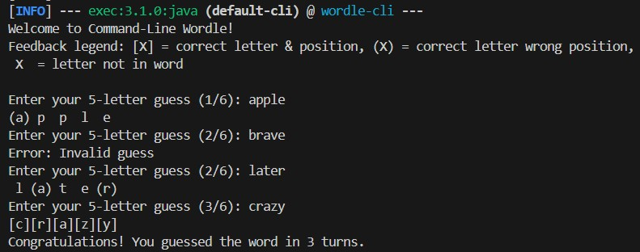
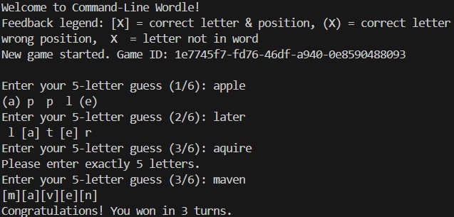
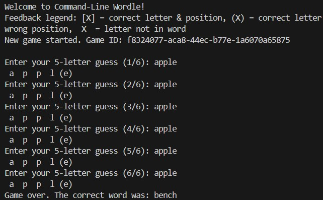
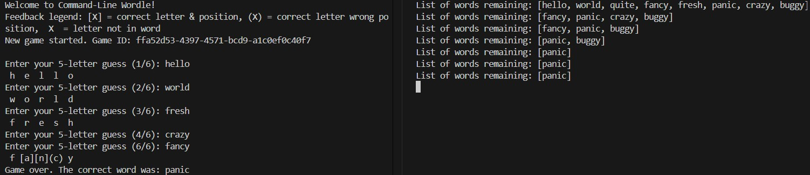

# Wordle Multi‑Module Project

This repository contains a multi‑module Maven project implementing a Wordle clone. It is structured into:

- **wordle-core**: Core game logic and data model.
- **wordle-cli**: A simple command‑line interface for playing Wordle (Task 1), uses classes in wordle-core directly.
- **wordle-client**: Client side module that calls the server API to receive game states and trigger game actions.
- **wordle-server**: REST API server for Task 2, handling game sessions and input validation.

---

## Table of Contents

- [Prerequisites](#prerequisites)
- [Modules](#modules)
- [Task 1: Normal wordle](#task-1-normal-wordle)
- [Task 2: Server/client wordle](#task-2-serverclient-wordle)
- [Task 3: Cheating Mode](#task-3-cheating-mode)

---

## Prerequisites

- Java 17 SDK (or later)
- Maven 3.6+
- Git

---

## Modules

### wordle-core

- Implements `WordleGame` and `WordleScorer`.
- Implements `CheatingWordleGame` (Task 3).
- Loads a 5‑letter word list from classpath (`src/main/resources/words.txt`).
- Supports configurable **maxTurns** and **wordFile** via constructors.

### wordle-cli

- Depends on **wordle-core**.
- Provides `App.java` for local CLI play (Task 1).
- Shows per-guess feedback:
  - **[X]** = correct letter & position
  - **(X)** = correct letter wrong position
  -  X  = letter not in word


### wordle-server

- Depends on **wordle-core** and Spring Boot.
- Exposes REST endpoints:
  - `POST /games` → create a new game, returns `{ "gameId": "..." }`
  - `POST /games/{id}/guesses` → submit a guess, returns marks & status
  - `GET  /games/{id}` → fetch current game state
- All answer logic and validation are performed server-side; clients never see the answer (Task 2).


### wordle-client

- Depends on **wordle-core** and uses Java HttpClient + Jackson.
- CLI client for Task 2:
  - Automatically fetches current `turnsUsed` and `maxTurns` before each guess
  - Submits guesses via `POST /games/{id}/guesses`
  - Handles invalid guesses by showing server's `message` and allowing retry
  - Displays final answer when game is over

---

## Task 1: Normal wordle

### Build & Test

From the project root:

```bash
mvn clean install
mvn -pl wordle-core test
```

### Running the CLI

```bash
mvn -pl wordle-cli exec:java
# or
java -jar wordle-cli/target/wordle-cli-1.0.0-SNAPSHOT.jar
```

Follow the prompt, enter a 5‑letter guess, and view feedback. A legend is shown on startup.



---

## Task 2: Server/client wordle

### Build & Run Server

```bash
mvn clean install
mvn -pl wordle-server spring-boot:run
# or package and run:
# mvn -pl wordle-server clean package
# java -jar wordle-server/target/wordle-server-1.0.0-SNAPSHOT.jar
```

The server listens on [**http://localhost:8080**](http://localhost:8080).

### API Endpoints

| Method | Path                  | Description                          |
| ------ | --------------------- | ------------------------------------ |
| POST   | `/games`              | Create new game, returns `gameId`    |
| POST   | `/games/{id}/guesses` | Submit guess, returns marks & status |
| GET    | `/games/{id}`         | Retrieve current game state          |

### Examples

**Create game**

```bash
curl.exe -X POST http://localhost:8080/games
# {"gameId":"<uuid>"}
```

**Submit guess**

```bash
curl.exe -X POST http://localhost:8080/games/<uuid>/guesses \
  -H "Content-Type: application/json" \
  -d '{"guess":"apple"}'
# {"marks":["HIT","MISS",…],"hasWon":false,"isOver":false,"turnsUsed":1}
```

**Query state**

```bash
curl.exe http://localhost:8080/games/<uuid>
# {"gameId":"<uuid>","turnsUsed":1,"hasWon":false,"isOver":false}
```

You can also use to the postman Collection in the root of this repo for API call tests:

```
Sandbox-VR-Wordle.postman_collection.json
```

### Run Client

```bash
mvn -pl wordle-client exec:java
```

Client interacts entirely via HTTP to the server.

A game success looks like:




A game failure looks like:



---

## Task 3: Cheating Mode

Cheating mode dynamically hosts the answer by always choosing the feedback bucket that is **least** helpful to the player (fewest **HIT**, then fewest **PRESENT**).

**Enable cheating** in the server by setting in `wordle-server/src/main/resources/application.properties`:

```properties
# set mode to "cheat" or "normal"
wordle.mode=cheat

# common settings
wordle.maxTurns=6
wordle.wordFile=words.txt
```

**REST API** remains unchanged; endpoints `/games` and `/games/{id}/guesses` now transparently apply cheating logic.

**Validate**:

```bash
# build and install core & server
mvn clean install -DskipTests
# start server
mvn -pl wordle-server spring-boot:run
# test cheating feedback
ID=$(curl -s -X POST http://localhost:8080/games | jq -r .gameId)
curl -X POST http://localhost:8080/games/$ID/guesses \
     -H "Content-Type: application/json" \
     -d '{"guess":"hello"}'
```

You can also use to the postman Collection in the root of this repo for API call tests:

```
Sandbox-VR-Wordle.postman_collection.json
```

An example run in cheat mode, left side shows the client side logs, right side shows the server side logs (indicating the dynamically changing word pool):



---

## Task 4: Multiplayer Mode

**Server support**:

The server now supports multiple players guessing the same word and monitoring each other's progress.

**Endpoints**:

1. **Join Game**
   ```
   POST /games/{gameId}/join
   Response: { "playerId": "<uuid>" }
   ```
2. **Submit Guess**
   ```
   POST /games/{gameId}/guesses
   Headers: X-Player-Id: <playerId>
   Body: { "guess": "apple" }
   ```
3. **View Progress**
   ```
   GET /games/{gameId}/progress
   Response: [
     { "playerId":"<id>", "turnsUsed":1, "hasWon":false, ... },
     { "playerId":"<id>", "turnsUsed":2, "hasWon":false, ... }
   ]
   ```

Use the same `gameId` returned by `POST /games`, then have each client `POST /join` to get its own `playerId`, include the header on guesses, and poll `/progress` to see all players' states.

You can also use to the postman Collection in the root of this repo for API call tests:

```
Sandbox-VR-Wordle.postman_collection.json
```

---

## Client Usage

In progress